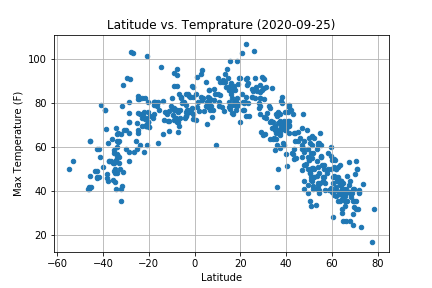

# python-api-challenge
Weather Analysis

The purpose of this project is to find weather data on select random cities around the world, then find the top ten vacation spots.

## WeatherPy
[This notebook](WeatherPy/WeatherPy.ipynb) generates at least 500 unique cities (using citipy) that can then be used to grab data on the City Latitude, City Longitude, Max Temperature (F), Humidity (%), Cloud Coverage (%), Wind Speed (mph), and the datetime from [OpenWeather](https://openweathermap.org/).

After gathering the data, it saves a [CSV file](WeatherPy/data/weather_data.csv) with the data we want to use to analyse:
* Temperature (F) vs. Latitude
* Humidity (%) vs. Latitude
* Cloudiness (%) vs. Latitude
* Wind Speed (mph) vs. Latitude

Then it calculates linear regression for:
* Northern Hemisphere - Temperature (F) vs. Latitude
* Southern Hemisphere - Temperature (F) vs. Latitude
* Northern Hemisphere - Humidity (%) vs. Latitude
* Southern Hemisphere - Humidity (%) vs. Latitude
* Northern Hemisphere - Cloudiness (%) vs. Latitude
* Southern Hemisphere - Cloudiness (%) vs. Latitude
* Northern Hemisphere - Wind Speed (mph) vs. Latitude
* Southern Hemisphere - Wind Speed (mph) vs. Latitude

### Example Plot for 2020-09-25

#### Temperature (F) vs. Latitude

* This chart shows that on September 25, 2020, the closer to the equator (latitude = 0), generally the hotter the temperature. Although it is slightly warmer in the Northern Hemisphere (latitude > 0), closer to the equator. This is likely because the Northern Hemisphere is closer to summer than winter compared to the Southern Hemisphere.

#### Humidity (%) vs. Latitude

#### Cloudiness (%) vs. Latitude

#### Wind Speed (mph) vs. Latitude

## VacationPy