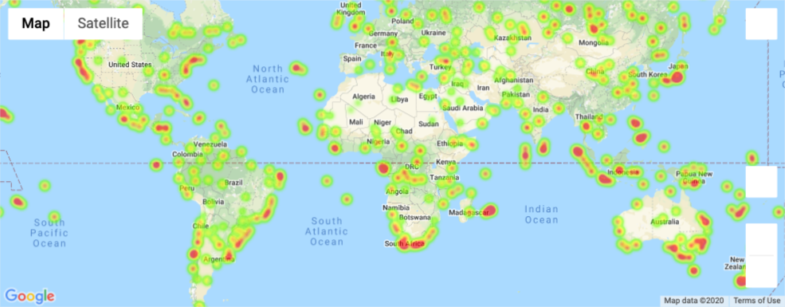
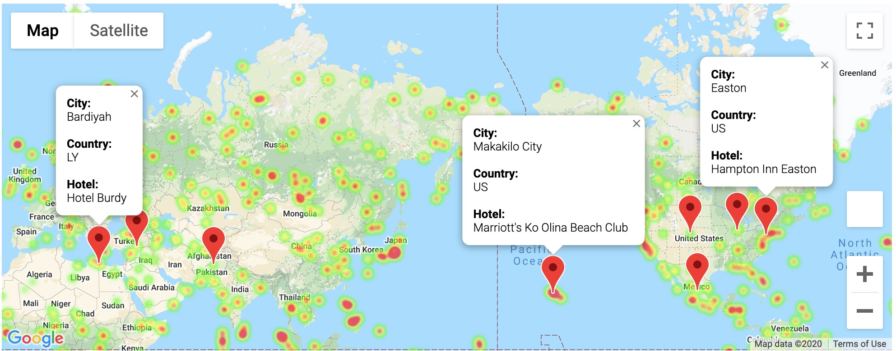

# python-api-challenge
Weather Analysis

The purpose of this project is to find weather data on select random cities around the world, then find the top ten vacation spots.

## WeatherPy
[This notebook](WeatherPy/WeatherPy.ipynb) generates at least 500 unique cities (using citipy) that can then be used to grab data on the City Latitude, City Longitude, Max Temperature (F), Humidity (%), Cloud Coverage (%), Wind Speed (mph), and the datetime from [OpenWeather](https://openweathermap.org/).

After gathering the data, it saves a [CSV file](WeatherPy/data/weather_data.csv) with the data we want to use to analyse:
* Temperature (F) vs. Latitude
* Humidity (%) vs. Latitude
* Cloudiness (%) vs. Latitude
* Wind Speed (mph) vs. Latitude

Then it calculates linear regression for:
* Northern Hemisphere - Temperature (F) vs. Latitude
* Southern Hemisphere - Temperature (F) vs. Latitude
* Northern Hemisphere - Humidity (%) vs. Latitude
* Southern Hemisphere - Humidity (%) vs. Latitude
* Northern Hemisphere - Cloudiness (%) vs. Latitude
* Southern Hemisphere - Cloudiness (%) vs. Latitude
* Northern Hemisphere - Wind Speed (mph) vs. Latitude
* Southern Hemisphere - Wind Speed (mph) vs. Latitude

### Example Plot for 2020-09-25

#### Temperature (F) vs. Latitude

* This chart shows that on September 25, 2020, the closer to the equator (latitude = 0), generally the hotter the temperature. Although it is slightly warmer in the Northern Hemisphere (latitude > 0), closer to the equator. This is likely because the Northern Hemisphere is closer to summer than winter compared to the Southern Hemisphere.

#### Humidity (%) vs. Latitude

* Humidity looks fairly evenly distributed across cities, which suggests minimal correlation. This could be a seasonal issue. Given that this chart is during autumn for the Northern Hemisphere, and spring for the Southern Hemisphere, I think it could be interesting to compare with a chart during summer/winter.

#### Cloudiness (%) vs. Latitude

* Cloudiness looks fairly evenly distributed across cities, which suggests minimal correlation.

#### Wind Speed (mph) vs. Latitude

* Wind speed looks fairly evenly distributed across cities, which suggests minimal correlation. Most wind speed is under 20mph. The higher wind speeds above 20mph are generally further away from the equator.

### Linear Regression for 2020-09-25

#### Northern Hemisphere vs. Temperature (F)

* This graph and r-value suggests there is pretty strong correlation between latitude and temperature in the northern hemisphere. With the data collected, 77% percent fit the regression model. The closer to the equator, the hotter it gets. This makes sense since the equator is the latitude that is closest to the sun.

#### Southern Hemisphere vs. Temperature (F)

* This graph and r-value suggests there is pretty strong correlation between latitude and temperature in the southern hemisphere, though not as strong as there is in the northern hemisphere. We can see here that it looks like there are a few outliers, where the temperature is over 100F between Latitude -30 and -20.

#### Northern Hemisphere vs. Humidity (%)

* This graph and r-value suggests there is unlikely any correlation between these factors.

#### Southern Hemisphere vs. Humidity (%)

* This graph and r-value suggests there is unlikely any correlation between these factors.

#### Northern Hemisphere vs. Cloudiness (%)

* This graph and r-value suggests there is unlikely any correlation between these factors.

#### Southern Hemisphere vs. Cloudiness (%)

* This graph and r-value suggests there is unlikely any correlation between these factors.

#### Northern Hemisphere vs. Wind Speed (mph)

* This graph and r-value suggests there is unlikely any correlation between these factors.

#### Southern Hemisphere vs. Wind Speed (mph)

* This graph and r-value suggests there is unlikely any correlation between these factors.

## VacationPy

[This Notebook](VacationPy.ipynb) takes the data from the CSV file produced by [WeatherPy](WeatherPy.ipynb) and produces a Google heatmap based on the humidity of each city, then finds cities from the data that contain ideal weather conditions (max temperature between 72-77F, 1% cloudiness or less, and wind speed less than 10mph), and uses those cities to call the Google Places API and find the nearest hotel within 5000m of the city's coordinates, then pins the hotels on the earlier heatmap.

*Heatmap for humidiy (%) for cities analyzed*

*The pins on this map are interactive so when you click on the pins, it will display the city, country, and hotel name, as shown in this example.*
