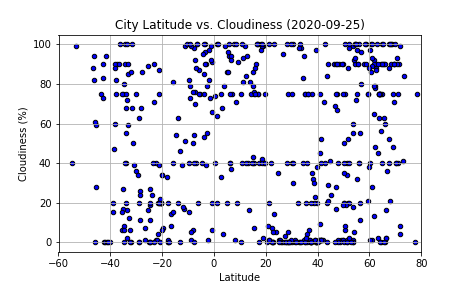
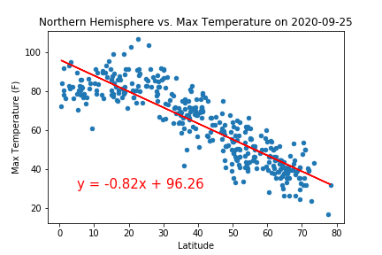

# python-api-challenge
Weather Analysis

The purpose of this project is to find weather data on select random cities around the world, then find the top ten vacation spots.

## WeatherPy
[This notebook](WeatherPy/WeatherPy.ipynb) generates at least 500 unique cities (using citipy) that can then be used to grab data on the City Latitude, City Longitude, Max Temperature (F), Humidity (%), Cloud Coverage (%), Wind Speed (mph), and the datetime from [OpenWeather](https://openweathermap.org/).

After gathering the data, it saves a [CSV file](WeatherPy/data/weather_data.csv) with the data we want to use to analyse:
* Temperature (F) vs. Latitude
* Humidity (%) vs. Latitude
* Cloudiness (%) vs. Latitude
* Wind Speed (mph) vs. Latitude

Then it calculates linear regression for:
* Northern Hemisphere - Temperature (F) vs. Latitude
* Southern Hemisphere - Temperature (F) vs. Latitude
* Northern Hemisphere - Humidity (%) vs. Latitude
* Southern Hemisphere - Humidity (%) vs. Latitude
* Northern Hemisphere - Cloudiness (%) vs. Latitude
* Southern Hemisphere - Cloudiness (%) vs. Latitude
* Northern Hemisphere - Wind Speed (mph) vs. Latitude
* Southern Hemisphere - Wind Speed (mph) vs. Latitude

### Example Plot for 2020-09-25

#### Temperature (F) vs. Latitude

* This chart shows that on September 25, 2020, the closer to the equator (latitude = 0), generally the hotter the temperature. Although it is slightly warmer in the Northern Hemisphere (latitude > 0), closer to the equator. This is likely because the Northern Hemisphere is closer to summer than winter compared to the Southern Hemisphere.

#### Humidity (%) vs. Latitude

* Humidity looks fairly evenly distributed across cities, which suggests minimal correlation. This could be a seasonal issue. Given that this chart is during autumn for the Northern Hemisphere, and spring for the Southern Hemisphere, I think it could be interesting to compare with a chart during summer/winter.

#### Cloudiness (%) vs. Latitude

* Cloudiness looks fairly evenly distributed across cities, which suggests minimal correlation.

#### Wind Speed (mph) vs. Latitude

* Wind speed looks fairly evenly distributed across cities, which suggests minimal correlation. Most wind speed is under 20mph. The higher wind speeds above 20mph are generally further away from the equator.

### Linear Regression for 2020-09-25

#### Northern Hemisphere vs. Temperature (F)

#### Southern Hemisphere vs. Temperature (F)

#### Northern Hemisphere vs. Humidity (%)

#### Southern Hemisphere vs. Humidity (%)

#### Northern Hemisphere vs. Cloudiness (%)

#### Southern Hemisphere vs. Cloudiness (%)

#### Northern Hemisphere vs. Wind Speed (mph)

#### Southern Hemisphere vs. Wind Speed (mph)

## VacationPy